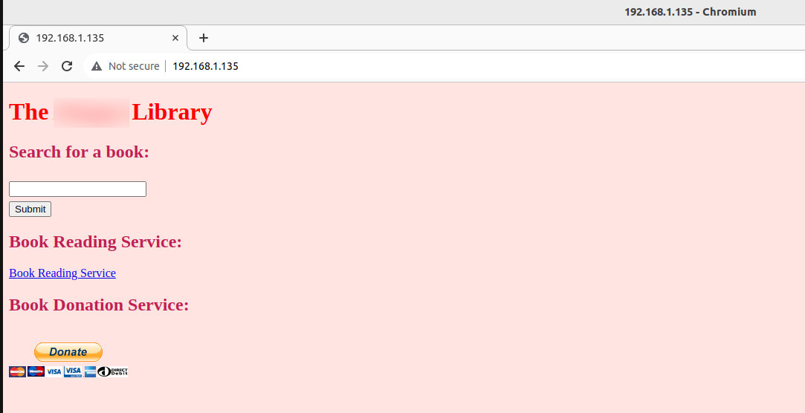
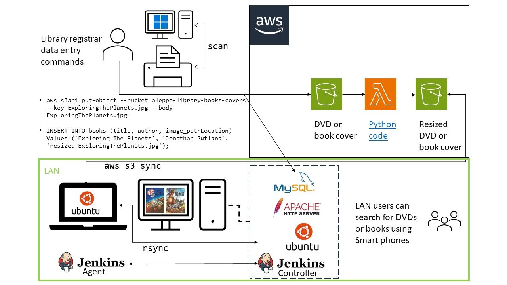

How to connect to the on prem stack ?

1- Open the terminal

2- run the command ``sudo mysql -u root -p``

3- Enter the password of the root user

How to show databases
``show databases;``

The backend MySQL db will be similar to:

+--------------------+
| Database           |
+--------------------+
| information_schema |
| library            |
| mysql              |
| performance_schema |
| sys                |
+--------------------+
5 rows in set (0.01 sec)
 
``mysql> use library;``
Reading table information for completion of table and column names
You can turn off this feature to get a quicker startup with -A

To add a book to the library

``mysql> INSERT INTO books (title, author, image_pathLocation) Values ('Exploring The Planets', 'Jonathan Rutland', 'images/resized-ExploringThePlanets.jpg');``

# the-library
DON'T USE THIS CODE IN PRODUCTION
THIS IS A **TESTING** ON PREM LAMP STACK.
ALL DB CONNECTIONS ARE TO localhost

Product UI

Architecture

